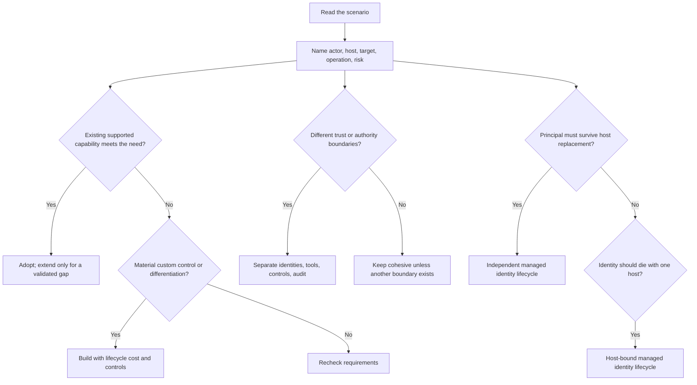

# Day 28: Mock Review

**Date**: 2026-09-06
**Scheduled plan date**: 2026-09-08
**Domain**: Mixed review - Plan (25-30%), Design (25-30%), Deploy (40-45%)
**Subtopics**: Trust-boundary decomposition, build-buy-extend, SLM selection, generative input validation, MCP orchestration, SharePoint permission trimming, telemetry filtering, environment-variable servicing, connector identity and DLP, managed-identity lifecycle
**Estimated study time**: 1 hr
**Review basis**: Day 27 questions q182, q187, q189, q076, q084, q090, q102, q123, q145, q178

> Day 27 scored 10/10, so there are no misses to remediate. This session is a proactive retention and trap-pattern review. It explains the decision rules behind the reviewed concepts without reproducing answer letters or an answer key.
>
> **Day 28 quiz status:** `day-assignments.json` assigns exactly 10 questions: q211 through q220. Use `@certprep /today` to open the assigned quiz.

---

## Session Briefing

**Session 28 of 31 | Completed sessions: 27 | Tracked attempts: 287 | Correct: 279 | Accuracy: 97.2%**

Day 27 was perfect. The most useful review is therefore not rereading explanations mechanically, but rehearsing the distinctions that plausible distractors try to collapse. Historical signals reinforce three traps: constrained generative inputs, agent sharing versus SharePoint authorization, and user-assigned identity for replaceable hosts.

Suggested timebox: 8 minutes TL;DR and recall, 30 minutes key concepts, 12 minutes trap table and decision framework, and 10 minutes closed-book retrieval practice.

---

## TL;DR (60-second skim)

- Split agents when trust, privilege, risk, ownership, or audit boundaries differ materially; decomposition is a control decision, not a default.
- Adopt a supported product for a commodity requirement, extend for a validated gap, and build only for material unmet requirements.
- Select the smallest evaluated model that meets quality, latency, deployment, and cost criteria; customize only to close a measured gap.
- Generative orchestration can choose capabilities and fill ordinary inputs, but constrained custom entity values still need explicit collection and validation.
- MCP gives Copilot Studio dynamically described tools and resources and requires generative orchestration; dynamic discovery does not bypass governance.
- Agent availability never grants source access: SharePoint permissions and sensitivity labels continue to constrain grounded responses.
- Filter Application Insights test-canvas telemetry with the explicit `designMode` dimension when building production-only queries.
- Keep environment-variable definition/default metadata separate from target-owned current values; never use ordinary exported defaults as a secret store.
- User credentials and DLP solve different problems: downstream authorization versus allowed connector/data paths.
- Use an independently managed identity when equivalent replaceable hosts need a stable principal and stable role assignments.

---

## Learning Objectives

After this review, you should be able to:

1. Identify the decisive requirement in each scenario before comparing products or controls.
2. Separate identity, authentication, authorization, data-movement policy, orchestration, and lifecycle concerns.
3. Reject answers that add model size, custom code, agents, or privileges without a measured requirement.
4. Explain all ten Day 27 concepts without relying on memorized option wording.
5. Recognize historical weak patterns under new scenario wording.

---

## Key Concepts

### 1. Multi-agent separation follows trust and authority

Do not split merely because a workflow contains multiple tasks. Split when the boundary lets you enforce different identities, permissions, human approvals, data classifications, audit paths, owners, or failure containment.

A low-trust retriever that consumes public or externally controlled content should not share broad runtime authority with a component that performs consequential ERP actions. Pass structured, provenance-bearing output across the boundary; then validate, reauthorize, approve where required, and audit in the privileged component.

Exam test: ask what concrete control the split creates. Claims that multiple agents are always cheaper, more accurate, or exempt from human approval are unjustified.

### 2. Build, buy, extend

Use a requirements-first sequence:

1. **Adopt/buy** when a supported licensed capability meets the common requirement and its governance needs.
2. **Extend** when the core product fits but a specific supported knowledge, connector, action, or workflow gap remains.
3. **Build** when differentiated behavior, bespoke orchestration, unsupported integration, custom runtime control, or specialized model needs cannot be met safely by the first two choices.

Compare lifecycle TCO: licensing, implementation, integration, data preparation, evaluation, monitoring, support, upgrades, consumption, security, and governance. Code ownership by itself is not business differentiation.

### 3. SLM and customization selection

Model selection is an evaluation problem, not a size contest. Establish representative quality thresholds and nonfunctional constraints for latency, throughput, hardware, deployment location, safety, and cost. If a catalog small language model meets them on target hardware, begin there and monitor drift.

Use this escalation ladder:

```text
Baseline evaluation
-> prompt and structured-output improvement
-> grounding for current knowledge / tools for actions
-> fine-tuning for a persistent measured behavior gap
-> different model family or size if criteria still fail
```

Fine-tuning adds data curation, lineage, training, evaluation, deployment, regression, and maintenance obligations. It is not warranted merely because training is possible.

### 4. Generative orchestration and constrained inputs

Generative orchestration selects topics, tools, agents, and knowledge by using names, descriptions, context, and input/output contracts. It can ask for missing ordinary inputs, but Microsoft documents limitations for custom closed-list and regex entities as direct generative topic or tool inputs.

For a constrained identifier:

1. Enter a topic with a precise description.
2. Use a **Question node** configured with the custom entity.
3. Store the validated value.
4. Pass that value to the downstream capability.

Probabilistic routing and deterministic validation are complementary. Do not weaken the data contract and hope the planner infers a valid value.

### 5. MCP in Copilot Studio

An MCP server publishes capability metadata. Copilot Studio currently supports MCP **tools** and **resources**; the connected server supplies names, descriptions, inputs, and outputs. Server changes are dynamically reflected, avoiding a manually authored topic for every operation.

MCP requires generative orchestration in Copilot Studio. It does not replace authentication, authorization, DLP, validation, approval, or third-party risk review. Clear server schemas and descriptions remain essential because the planner uses them for selection.

### 6. Agent access versus SharePoint authorization

Keep these gates separate:

| Gate | Governs |
| --- | --- |
| Publish/channel | Where the agent runs |
| Share/discoverability | Who can find or invoke the agent |
| User authentication | Which user is present |
| Source authorization | Which files or records that user may access |

Microsoft 365 agents grounded in SharePoint continue to respect the current user's permissions. Sensitivity labels and source controls still apply. The owner's broad access, organization-wide sharing, or a sharing link does not become delegated access to restricted content.

### 7. Copilot Studio telemetry scope

Built-in Analytics offers curated outcome and usage views. Application Insights supplies event-level telemetry for Kusto analysis and operational correlation. Their numbers can differ because Application Insights includes conversations from the Copilot Studio test canvas.

Production-only filter:

```kusto
customEvents
| extend isDesignMode = customDimensions['designMode']
| where isDesignMode == "False"
```

Before declaring data loss, reconcile time range, ingestion delay, dashboard filters, event schema, and test-mode inclusion. Channel names are not a substitute for the explicit test-mode field.

### 8. Environment-variable servicing

| Element | Meaning | Ownership |
| --- | --- | --- |
| Definition | Schema name, type, description, metadata | Solution publisher |
| Default value | Packaged fallback | Solution publisher |
| Current value | Environment-specific override | Target environment |

A target current value takes precedence when present. Managed-solution servicing can update definition/default metadata without treating the customer's current value as publisher-owned configuration. Apps and flows should resolve through the variable rather than duplicate hard-coded endpoints.

Secrets require an appropriate secret-management design. A production credential in an ordinary exported default creates leakage and lifecycle problems.

### 9. Tool credentials and DLP are complementary

- **User authentication for a tool** lets the downstream service evaluate the current user's permissions.
- **Agent author authentication** uses the connection configured by the author and is suitable only where shared authority is intended and governed.
- **Power Platform data policies** classify, block, or isolate connectors and prevent disallowed combinations or data paths.

User credentials do not prevent exfiltration through an unsafe connector. DLP does not grant or evaluate record-level access. Conversation sign-in does not automatically choose the tool connection identity, and content filters do neither job.

For user-restricted regulated records plus a possible arbitrary HTTP path, address both source authorization and connector/data-path governance.

### 10. Managed identity lifecycle

| Property | System-assigned | User-assigned |
| --- | --- | --- |
| Creation | On one Azure resource | Standalone Azure resource |
| Lifecycle | Tied to the host | Independent; explicitly deleted |
| Sharing | One host only | Multiple supported hosts |
| Replacement | New host means a new principal | Existing principal can attach to the new host |
| Typical fit | Unique workload whose identity should die with its host | Equivalent replicas, blue-green, preauthorization, recycled compute |

Managed identity removes application-managed credentials; it does not grant access automatically. Authorize the principal separately on each target using the minimum actions and narrowest practical scope.

The Day 26 first attempt exposed the key wording pattern: **replaceable hosts plus persistent permissions**. That points to an identity lifecycle independent of compute. Do not generalize this into sharing one identity across unlike duties; every attached host can exercise that identity's union of permissions.

---

## Decision Frameworks



Five-pass exam method:

1. Underline the decisive requirement: trust, authority, lifecycle, measured quality, or target ownership.
2. Identify the control layer being asked about.
3. Prefer the least-complex supported design that satisfies every stated constraint.
4. Reject answers that solve a different layer, such as DLP for record authorization.
5. Challenge absolute words such as *always*, *automatically*, *all*, *only*, and *replaces*.

---

## Comparisons

| Confusable pair | First concept | Second concept |
| --- | --- | --- |
| One agent / multiple agents | Same trust and authority can stay cohesive | Split across materially different trust or privilege |
| Adopt / extend / build | Start with a fit-for-purpose product | Add only demonstrated gaps; build for material unmet needs |
| SLM / larger or customized model | Use when measured criteria are met | Escalate only for a measured deficit |
| Planner input / Question node | Flexible semantic extraction | Explicit custom regex or closed-list validation |
| MCP / static integration | Dynamic tools/resources metadata | Fixed manually maintained contract |
| Agent sharing / source access | Availability of the experience | Authorization to underlying content |
| Analytics / Application Insights | Curated product trends | Event-level custom telemetry and Kusto |
| Default / current environment value | Publisher fallback | Target-specific override |
| User credentials / DLP | Downstream user authorization | Permitted connector and data combinations |
| Host-bound / independent identity | Principal follows one resource | Principal and permissions survive equivalent host replacement |

---

## Important Details for Exam

- The current AB-100 study guide lists skills measured as of **July 22, 2026**; Domain 3 remains the largest at 40-45%.
- Copilot Studio generative orchestration can select multiple topics, tools, agents, and knowledge sources from their descriptions and contracts.
- Copilot Studio currently supports MCP tools and resources, and MCP usage requires generative orchestration.
- Application Insights captures test-canvas telemetry; `designMode` is present on events with `"True"` or `"False"` values.
- A current environment-variable value is target-specific and overrides the default when present.
- Power Platform data policies can govern connectors including HTTP; they are not a row-level authorization mechanism.
- A system-assigned service principal is deleted with its Azure resource; a user-assigned identity has an independent lifecycle and can attach to multiple resources.
- Microsoft explicitly lists frequently recycled resources with stable permissions as a user-assigned identity use case.
- Identity authentication and target authorization remain separate steps.

---

## Common Traps & Misconceptions

| Reviewed concept | Likely exam trap | Durable correction |
| --- | --- | --- |
| q182: multi-agent boundary | One broad identity is simpler | Privilege and trust boundaries outweigh operational convenience |
| q187: build-buy-extend | Custom code is automatically more strategic | Start with an existing fit; customize only for proven gaps |
| q189: SLM selection | Largest or fine-tuned model is inherently best | Let measured acceptance criteria decide |
| q076: constrained input | The planner directly enforces every custom entity | Collect and validate constrained values explicitly |
| q084: MCP | Copy tool descriptions into prompts or hard-code topics | Use the live MCP capability contract with required orchestration |
| q090: SharePoint grounding | Broad agent sharing grants broad document access | Agent access and source authorization are separate |
| q102: telemetry | Dashboard mismatch proves lost production events | Reconcile test inclusion and filter the explicit dimension |
| q123: environment variables | Publisher updates overwrite target current values | Definition/default and current value have separate ownership |
| q145: credentials and DLP | One control replaces the other | Enforce both user authorization and connector-path policy |
| q178: managed identity | Any managed identity keeps one principal across replacement | Choose lifecycle independently from replaceable compute |

Historical pattern check:

- **q076** was previously missed by overestimating what generative orchestration directly validates.
- **q090** was previously missed by conflating organization-wide agent availability with access to restricted SharePoint content.
- **q178** was missed before remediation by tying the principal to replaceable hosts instead of the stable workload permission boundary.

These are all **boundary errors**, not missing product vocabulary. On the exam, draw the boundary before selecting the feature.

---

## Quick Reference Card

```text
Different trust/privilege         -> separate agents and identities
Commodity need already covered   -> adopt; extend for a demonstrated gap
Small model meets criteria        -> use and monitor before customization
Regex/closed-list value           -> explicit Question-node validation
Dynamic MCP capabilities          -> MCP + generative orchestration
Agent shared broadly              -> source ACLs and labels still govern
Production-only App Insights      -> designMode == "False"
Managed solution update           -> preserve target current value
Per-user records + risky HTTP     -> user credential model + DLP policy
Replaceable equivalent hosts      -> identity lifecycle independent of hosts
```

Closed-book recall prompts:

1. Name the four separate gates from publishing to source authorization.
2. Explain why DLP cannot substitute for downstream record permissions.
3. Explain why a stable principal matters during blue-green replacement.
4. State when fine-tuning becomes justified.
5. Explain why a low-trust retriever and privileged approver may need separate identities.

---

## Cross-Domain Quiz Question Refreshers

| Concept | Domain | Key fact to recall | Trap to reject |
| --- | --- | --- | --- |
| Multi-agent trust boundary | D1.2 | Decompose when different authority or risk needs enforceable isolation | More agents are always better |
| Build-buy-extend | D1.2/D1.3 | Prefer the lowest-complexity supported fit over custom ownership | Building before validating product gaps |
| SLM selection | D1.2 | Evaluate quality plus latency, cost, hardware, and deployment constraints | Model size as a proxy for suitability |
| Generative constrained inputs | D2.1 | Keep explicit validation for custom constrained entities | Assuming orchestration validates every type |
| MCP | D2.2 | Dynamic tools/resources require generative orchestration | Static prompt text as equivalent integration |
| SharePoint-grounded agents | D2.2 | Runtime source permissions and labels still apply | Agent owner or sharing overrides source ACLs |
| Telemetry filtering | D3.1 | App Insights includes test events identified by `designMode` | Filtering by channel alone |
| Environment variables | D3.3 | Target current value is separate from publisher definition/default | Shipping target secrets in defaults |
| Connector credentials and DLP | D3.4 | Identity and data-path controls must both be designed | Authentication as automatic DLP |
| Managed identity lifecycle | D3.4 | Independent identity fits recycled equivalent compute | Host-bound principal for stable cross-host RBAC |

---

## Related Questions in questions.json

- **q182** - Trust and authorization boundaries in a multi-agent design.
- **q187** - Build-buy-extend sequencing for an already-covered business capability.
- **q189** - SLM selection after evidence-based evaluation.
- **q076** - Custom constrained entity collection under generative orchestration.
- **q084** - MCP dynamic capability integration and orchestration prerequisite.
- **q090** - SharePoint permission and sensitivity-label enforcement through an agent.
- **q102** - Production-only filtering of Copilot Studio Application Insights events.
- **q123** - Managed-solution servicing of environment-variable metadata and target values.
- **q145** - Per-user tool identity combined with connector data policy.
- **q178** - Stable managed identity across equivalent replaceable hosts.

No answer letters or option keys are included in this review.

---

## Quiz Next Step

Day 28 is assigned exactly 10 questions: **q211, q212, q213, q214, q215, q216, q217, q218, q219, and q220**. Use the installed VS Code Cert Prep extension:

```text
@certprep /today
```

Confirm that it shows **Day 28 - Mock Review** with exactly 10 assigned questions, then start the quiz.

---

## Sources (verified live during this session)

- [Study guide for Exam AB-100: Agentic AI Business Solutions Architect](https://learn.microsoft.com/en-us/credentials/certifications/resources/study-guides/ab-100)
- [AI Agent Orchestration Patterns](https://learn.microsoft.com/en-us/azure/architecture/ai-ml/guide/ai-agent-design-patterns)
- [Orchestrate agent behavior with generative AI](https://learn.microsoft.com/en-us/microsoft-copilot-studio/advanced-generative-actions)
- [Extend your agent with Model Context Protocol](https://learn.microsoft.com/en-us/microsoft-copilot-studio/agent-extend-action-mcp)
- [Add knowledge sources to your declarative agent in Microsoft 365 Copilot](https://learn.microsoft.com/en-us/microsoft-365/copilot/extensibility/agent-builder-add-knowledge)
- [Agent-level telemetry with Application Insights](https://learn.microsoft.com/en-us/microsoft-copilot-studio/advanced-bot-framework-composer-capture-telemetry)
- [Use environment variables in Power Platform solutions](https://learn.microsoft.com/en-us/power-apps/maker/data-platform/environmentvariables)
- [Configure data policies for agents](https://learn.microsoft.com/en-us/microsoft-copilot-studio/admin-data-loss-prevention)
- [Configure user authentication for tools](https://learn.microsoft.com/en-us/microsoft-copilot-studio/configure-enduser-authentication)
- [Managed identities for Azure resources](https://learn.microsoft.com/en-us/entra/identity/managed-identities-azure-resources/overview)
- [Microsoft Foundry Models overview (classic)](https://learn.microsoft.com/en-us/azure/foundry-classic/concepts/foundry-models-overview)

---

## Notes (your own words - fill this in after studying)

- Strongest retained distinction:
- Most tempting distractor pattern:
- Rule to revisit before Day 29:
